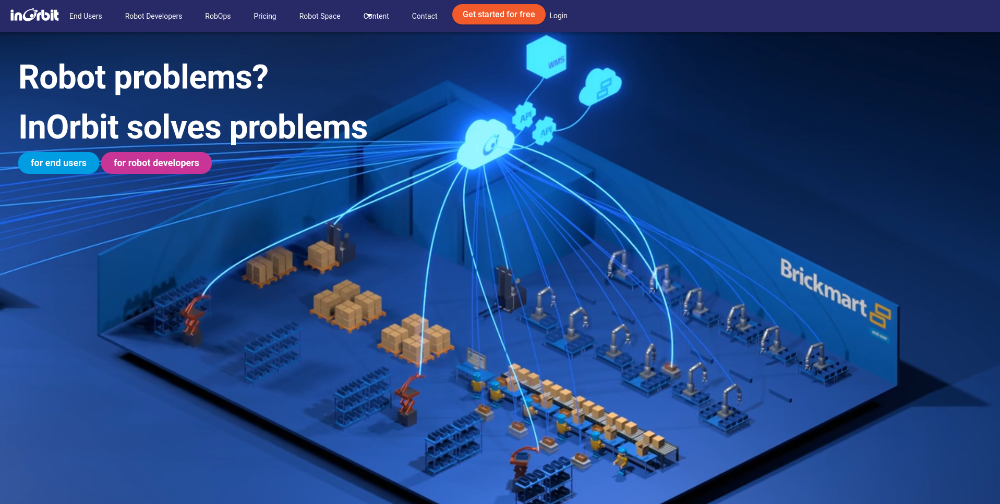
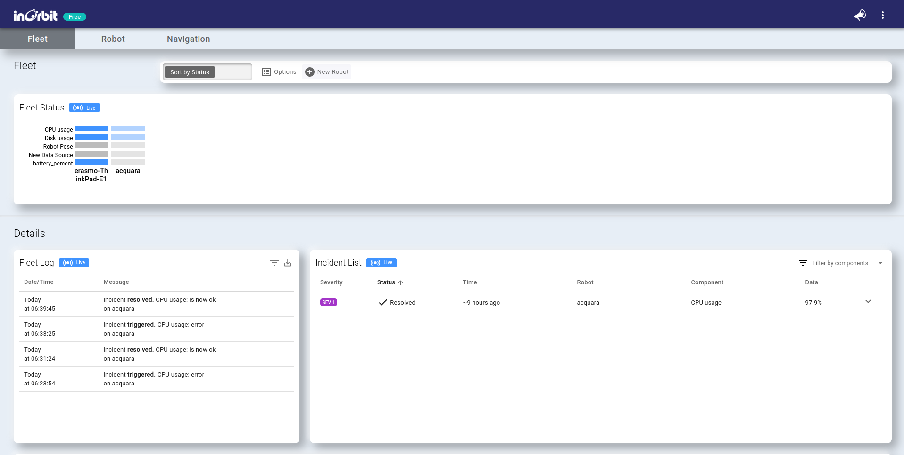
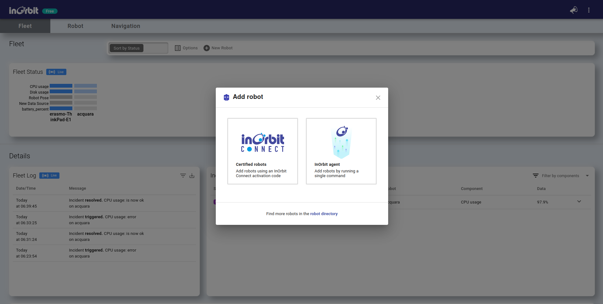

# Andino and InOrbit Integration Tutorial

Welcome to this tutorial on integrating InOrbit with your Andino robot! In this step-by-step guide, we will walk you through the process of seamlessly connecting InOrbit, a cloud-based robot operations platform, with Andino—a fully open-source, educational, and cost-effective differential drive robot integrated with ROS 2.

By following this tutorial, you will harness the power of InOrbit's comprehensive monitoring, management, and optimization features to elevate your robotics projects. Whether you are a student, hobbyist, or developer, this integration will enable you to gain valuable insights into your robot's performance and enhance your skills in the exciting field of robotics.

Let's get started with the integration process!

## Andino

Andino is a fully open-source diff drive robot designed for educational purposes and low-cost applications. It is fully integrated with ROS 2 and it is a great base platform to improve skills over the robotics field. With its open-source design, anyone can modify and customize the robot to suit their specific needs.

[Andino Github](https://github.com/Ekumen-OS/andino)


## Setup

### Platforms

- ROS 2: Humble Hawksbill
- OS:
  - Ubuntu 22.04 Jammy Jellyfish
  - Ubuntu Mate 22.04 (On real robot (e.g: Raspberry Pi 4B))

### Build from Source

#### Dependencies

1. Install [ROS 2](https://docs.ros.org/en/humble/Installation/Ubuntu-Install-Debians.html)
2. Install [colcon](https://colcon.readthedocs.io/en/released/user/installation.html)

#### colcon workspace

Packages here provided are colcon packages. As such a colcon workspace is expected:

1. Create colcon workspace

```bash
mkdir -p ~/ws/src
```

2. Clone this repository in the `src` folder

```bash
cd ~/ws/src
```

```bash
git clone https://github.com/Ekumen-OS/andino.git
```

3. Install dependencies via `rosdep`

```bash
cd ~/ws
```

```bash
rosdep install --from-paths src --ignore-src -i -y
```

4. Build the packages

```bash
colcon build
```

5. Finally, source the built packages
   If using `bash`:

```bash
source install/setup.bash
```

`Note`: Whether your are installing the packages in your dev machine or in your robot the procedure is the same.

## Usage

### Robot bringup

`andino_bringup` contains launch files that concentrates the process that brings up the robot.

After installing and sourcing the andino's packages simply run.

```bash
ros2 launch andino_bringup andino_robot.launch.py
```

This launch files initializes the differential drive controller and brings ups the system to interface with ROS.
By default sensors like the camera and the lidar are initialized. This can be disabled via arguments and manage each initialization separately. See `ros2 launch andino_bringup andino_robot.launch.py -s ` for checking out the arguments.

- include_rplidar: `true` as default.
- include_camera: `true` as default.

After the robot is launched, use `ROS 2 CLI` for inspecting environment. E.g: By doing `ros2 topic list` the available topics can be displayed.


### RViz

Use:

```bash
ros2 launch andino_bringup rviz.launch.py
```

For starting `rviz2` visualization with a provided configuration.

## :compass: Navigation

The [`andino_navigation`](./andino_navigation/README.md) package provides a navigation stack based on the great [Nav2](https://github.com/ros-planning/navigation2) package.

https://github.com/Ekumen-OS/andino/assets/53065142/29951e74-e604-4a6e-80fc-421c0c6d8fee

_Important!: At the moment this package is only working with the simulation. The support for the real robot is forthcoming._

## InOrbit

InOrbit streamlines robot operations (RobOps) of any size with a cloud-based robot management platform built to maximize the potential of every robot. [Home page](https://www.inorbit.ai/)

Setting up an InOrbit account involves a few simple steps. Here's a structured guide to help you through the process:

**Step 1: Sign Up**

1. Visit the InOrbit website: [https://www.inorbit.ai/](https://www.inorbit.ai/).



2. Click on the "Get Started" button, typically located in the upper center corner of the website.

3. Fill out the registration form, providing the required information:
   - Email address

4. Accept the terms of service and privacy policy.

5. Click on the "Submit" button to submit your registration.

**Step 2: Verify Your Email**

1. Check your email inbox for a verification message from InOrbit.

2. Open the verification email and click on the provided verification link. This step confirms your email address and activates your InOrbit account.

**Step 3: Log In to Your Account**

1. Return to the InOrbit website.

2. Click on the "Log In" button, typically located in the upper center corner of the website.

3. Enter the email address and password you used during registration.

4. Click on the "Log In" or "Sign In" button to access your InOrbit account.



**Step 4: Create a Fleet**

1. In the InOrbit dashboard, click on the "Fleets" tab.

2. Click "New Robot" and click InOrbit agent

3. Copy the command print in the screen, it should have a structure like it

   ```bash
   curl https://control.inorbit.ai/liftoff/<FLEET_ID> | sh
   ```



**Step 5: Install the InOrbit Agent on Andino**

1. On your robot, open a terminal or SSH into it.

2. Using the command copied before, paste it in the shell.

3. Follow the prompts to complete the installation.

**Step 6: Verify Connection**

1. In your InOrbit dashboard, go to the fleet you created earlier.

2. Click on "Robots" and verify that your robot appears in the list. It may take a moment for the robot to appear.

**Step 5: Verify Connection**

1. In your InOrbit dashboard, go to the fleet you created earlier.

2. Click on "Robots" and verify that your robot appears in the list. It may take a moment for the robot to appear.

**Step 6: Monitor and Manage Your Robot Fleet**

1. Once your robot is connected to InOrbit, you can monitor its status, update software, and manage its operation from the InOrbit dashboard.

2. Explore the InOrbit dashboard to access various features such as mission planning, real-time telemetry, and remote robot control.

You have successfully configured the InOrbit connector for your robot using InOrbit Agent.